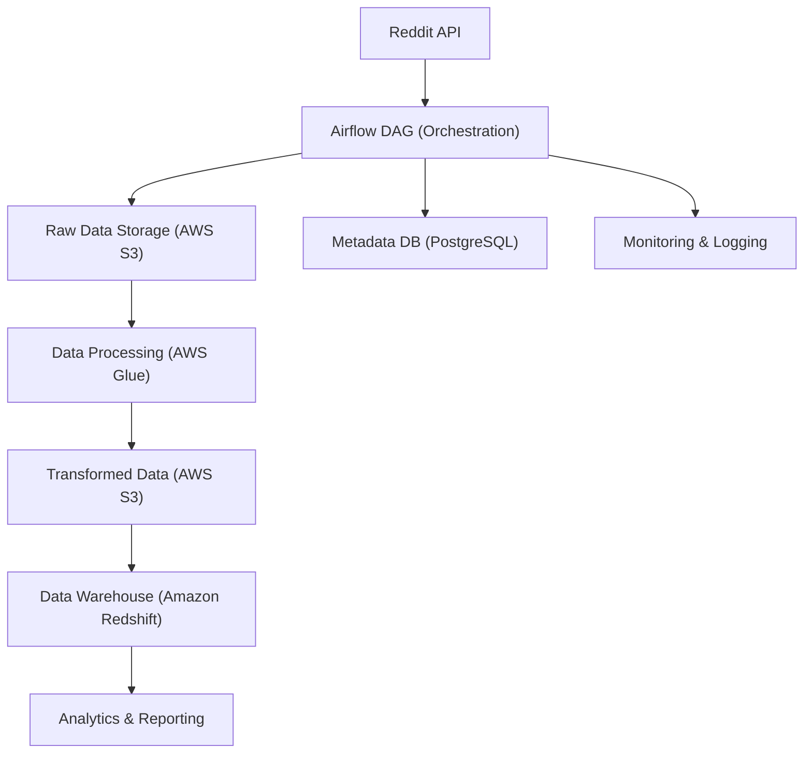

# Reddit Data Engineering Pipeline

[](https://github.com/noshikchowdary/DE_Reddit/actions/workflows/ci-cd.yml)
[](https://codecov.io/gh/noshikchowdary/DE_Reddit)
[](https://hub.docker.com/r/noshik/reddit-data-pipeline)
[](https://www.python.org/downloads/)
[](LICENSE)

A modern, scalable data pipeline that demonstrates advanced data engineering practices. This project showcases my expertise in building production-grade data pipelines using industry-standard tools and best practices.

## 🌟 Key Features

- **Modern Tech Stack**: Apache Airflow, Celery, PostgreSQL, AWS Services
- **Production-Ready**: Includes monitoring, logging, and error handling
- **Scalable Architecture**: Designed for high performance and reliability
- **Best Practices**: Implements data engineering best practices and patterns
- **Containerized**: Easy deployment using Docker and docker-compose
- **CI/CD Ready**: Includes GitHub Actions workflow for automated testing and deployment

## 🚀 Business Use Case

Organizations and researchers need to analyze Reddit discussions to track trends, sentiment, and emerging topics. This pipeline automates the extraction, transformation, and loading (ETL) of Reddit data, enabling advanced analytics and reporting for business intelligence and research.

## 📊 What Data is Extracted?

- **Submissions & Comments** from specified subreddits
- **Metadata:** author, timestamp, score, etc.
- **Purpose:** Enables sentiment analysis, trend detection, and community insights

## 📝 Sample Output

- Parquet/CSV files in AWS S3
- Transformed tables in your data warehouse (via dbt)
- Example:
  

## Architecture



*Architecture flow diagram: Render this on GitHub or with Mermaid tools for a visual overview.*

The pipeline follows a modern data engineering architecture:

1. **Data Extraction**: Reddit API integration for data collection
2. **Orchestration**: Apache Airflow with Celery for distributed task execution
3. **Data Processing**: 
   - Raw data storage in S3
   - Data transformation using AWS Glue
   - SQL-based processing with Amazon Athena
4. **Data Warehouse**: Amazon Redshift for analytics and reporting
5. **Metadata Management**: PostgreSQL for pipeline metadata and state management

## 🛠️ Technical Stack

- **Orchestration**: Apache Airflow, Celery
- **Storage**: PostgreSQL, Amazon S3
- **Processing**: AWS Glue, Amazon Athena
- **Warehouse**: Amazon Redshift
- **Infrastructure**: Docker, docker-compose
- **Language**: Python 3.9+
- **CI/CD**: GitHub Actions
- **Testing**: pytest, flake8, black, isort
- **Security**: Bandit, Safety

## 📋 Prerequisites

- AWS Account with appropriate IAM permissions
- Reddit API credentials
- Docker and Docker Compose
- Python 3.9 or higher

## 🚀 Quick Start

1. Clone the repository:
   ```bash
   git clone https://github.com/noshikchowdary/DE_Reddit.git
   cd DE_Reddit
   ```

2. Set up your environment:
   ```bash
   python3 -m venv venv
   source venv/bin/activate
   pip install -r requirements.txt
   ```

3. Configure your environment:
   ```bash
   cp config/config.conf.example config/config.conf
   # Edit config.conf with your credentials
   ```

4. Start the services:
   ```bash
   ./scripts/deployment/deploy.sh
   ```

5. Access the Airflow UI:
   ```bash
   open http://localhost:8080
   ```

## 📊 Pipeline Components

- **Data Extraction**: Custom Reddit API client
- **Data Processing**: ETL jobs in AWS Glue
- **Data Quality**: Automated testing and validation
- **Monitoring**: Airflow DAG monitoring and alerting
- **Documentation**: Comprehensive inline documentation

## 🧪 Testing

Run the test suite:
```bash
pytest tests/
```

Run code quality checks:
```bash
flake8 .
black . --check
isort . --check-only
```

## 🔒 Security

- Environment variables for sensitive data
- Secure credential management
- Regular security scanning
- Docker security best practices

## 📈 Monitoring

- Airflow task monitoring
- Custom metrics collection
- Error tracking and alerting
- Performance monitoring

## 🤝 Contributing

Contributions are welcome! Please feel free to submit a Pull Request.

## 📝 License

This project is licensed under the MIT License - see the LICENSE file for details.

## 🔗 Connect

- GitHub: [noshikchowdary](https://github.com/noshikchowdary)
- LinkedIn: [https://www.linkedin.com/in/noshik-chowdary/]

## 🙏 Acknowledgments

- Apache Airflow community
- AWS documentation
- Reddit API documentation
- Open source community

## 📚 Documentation

For detailed documentation, please refer to:
- [Architecture Documentation](docs/architecture/ARCHITECTURE.md)
- [API Documentation](docs/api/API.md)
- [Deployment Guide](docs/deployment/DEPLOYMENT.md)

## 🎯 Project Showcase

### Key Technical Achievements

1. **Scalable Architecture**
   - Distributed processing with Celery
   - Horizontal scaling capabilities
   - Efficient resource utilization

2. **Production-Ready Features**
   - Comprehensive error handling
   - Automated monitoring and alerting
   - Data quality checks
   - Backup and recovery procedures

3. **DevOps Best Practices**
   - CI/CD pipeline with GitHub Actions
   - Automated testing and code quality checks
   - Docker containerization
   - Infrastructure as Code

4. **Security Implementation**
   - Secure credential management
   - Regular security scanning
   - Access control and authentication
   - Data encryption

### Business Impact

1. **Data Quality**
   - Automated data validation
   - Real-time monitoring
   - Data lineage tracking

2. **Cost Optimization**
   - Efficient resource utilization
   - Automated scaling
   - Cost-effective storage solutions

3. **Maintainability**
   - Well-documented code
   - Modular architecture
   - Easy deployment process

### Future Enhancements

1. **Real-time Processing**
   - Stream processing capabilities
   - Real-time analytics
   - Event-driven architecture

2. **Advanced Analytics**
   - Machine learning integration
   - Predictive analytics
   - Custom visualization dashboards